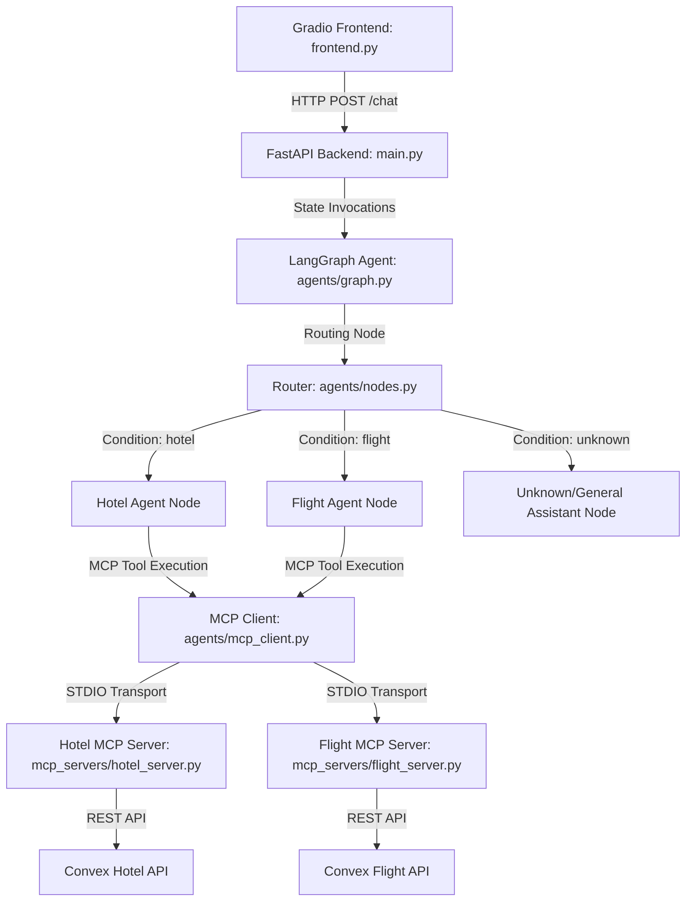

# Multi-Agent Travel Planner

A comprehensive, state-of-the-art travel booking system featuring hotel and flight agents powered by **LangChain**, **LangGraph**, and the **Model Context Protocol (MCP)**. This application provides a natural language chat interface that enables users to list, search, and book hotels and flights dynamically.

## 🛠️ System Architecture

The project is structured with a modular, service-oriented architecture:



### Key Components
1. **Gradio Frontend (`frontend.py`)**: A modern and responsive chat interface for user interaction.
2. **FastAPI Backend (`main.py`)**: Exposes API endpoints for chat, hotel listings, and flight listings.
3. **LangGraph Router & Nodes (`agents/graph.py` & `agents/nodes.py`)**: A StateGraph workflow engine that parses user intents, manages conversation history, extracts entities, and routes tasks to the appropriate backend agent.
4. **MCP Client (`agents/mcp_client.py`)**: Handles STDIO-based communication with the MCP servers dynamically. It includes thread-safe pooling to safely run async tool operations under synchronous LangGraph/FastAPI execution loops.
5. **MCP Servers (`mcp_servers/`)**:
   * **Hotel MCP Server (`hotel_server.py`)**: Provides tools to fetch all hotels, search hotels by city/dates, and book hotel rooms.
   * **Flight MCP Server (`flight_server.py`)**: Provides tools to fetch all flights, search flights by route/dates, and book flight tickets.

---

## 🚀 Setup & Installation

### 1. Prerequisites
Ensure you have **Python 3.12** installed on your system.

### 2. Clone the Repository & Navigate
```bash
cd multi-agent-travel-planner
```

### 3. Create & Activate a Virtual Environment
```bash
python3 -m venv .venv
source .venv/bin/activate
```

### 4. Install Dependencies
```bash
pip install -r requirements.txt
```

### 5. Configure Environment Variables
Create a `.env` file in the project root and add your OpenAI API key:
```env
OPENAI_API_KEY=your_openai_api_key_here

```

---

## Running the Application

Both the backend and frontend services must be running concurrently.

### 1. Start the FastAPI Backend
With your virtual environment activated:
```bash
python main.py
```
*The backend server starts on [http://localhost:8000](http://localhost:8000).*

### 2. Start the Gradio Frontend
In a new terminal shell (with the virtual environment activated):
```bash
python frontend.py
```
*The frontend web interface starts on [http://127.0.0.1:7860](http://127.0.0.1:7860).*

---

## 🌐 API Endpoints

You can also interact directly with the FastAPI backend:

| Endpoint | Method | Description | Example Curl Command |
|----------|--------|-------------|----------------------|
| `/hotels` | GET | Retrieve list of all available hotels | `curl http://localhost:8000/hotels` |
| `/flights` | GET | Retrieve list of all available flights | `curl http://localhost:8000/flights` |
| `/chat` | POST | Interact with the Travel Agent Graph | See payload below |

### `/chat` Request Payload Example
```bash
curl -X POST http://localhost:8000/chat \
  -H "Content-Type: application/json" \
  -d '{"message": "find flights from BKK to SIN on 2025-11-15"}'
```

---

## 💬 Queries to Try
Once the application is running, type these into the Gradio UI to test the agents:
* **Hotel Search:** *"Show me hotels in Bangkok from 2026-08-01 to 2026-08-05"*
* **Hotel Booking:** *"Book hotel H123 for Jane Doe, guest email jane.doe@example.com from 2026-08-01 to 2026-08-05 with a suite"*
* **Flight Search:** *"Find me all flights from NRT to ICN on 2025-11-15"*
* **Flight Booking:** *"Book flight F456 for John Smith with email john@example.com"*
* **General Travel Assistant:** *"Can I bring liquids on my flight?"*